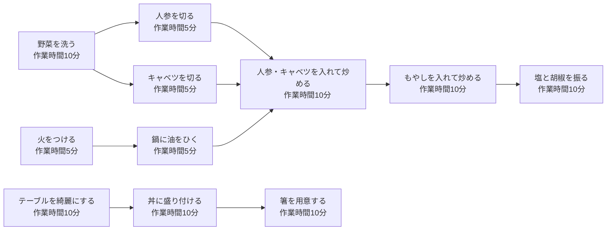

```mermaid
flowchart LR
    third1[野菜を洗う
    作業時間10分]
    third2[人参を切る
    作業時間5分]
    third3[キャベツを切る
    作業時間5分]
    third4[火をつける
    作業時間5分]
    third5[鍋に油をひく
    作業時間5分]
    third6[人参・キャベツを入れて炒める
    作業時間10分]
    third7[もやしを入れて炒める
    作業時間10分]
    third8[塩と胡椒を振る
    作業時間10分]
    third9[テーブルを綺麗にする
    作業時間10分]
    third10[丼に盛り付ける
    作業時間10分]
    third11[箸を用意する
    作業時間10分]
    third1-->third2
    third1-->third3
    third2-->third6
    third3-->third6
    third4-->third5
    third5-->third6
    third6-->third7
    third7-->third8
    third9-->third10
    third10-->third11
```