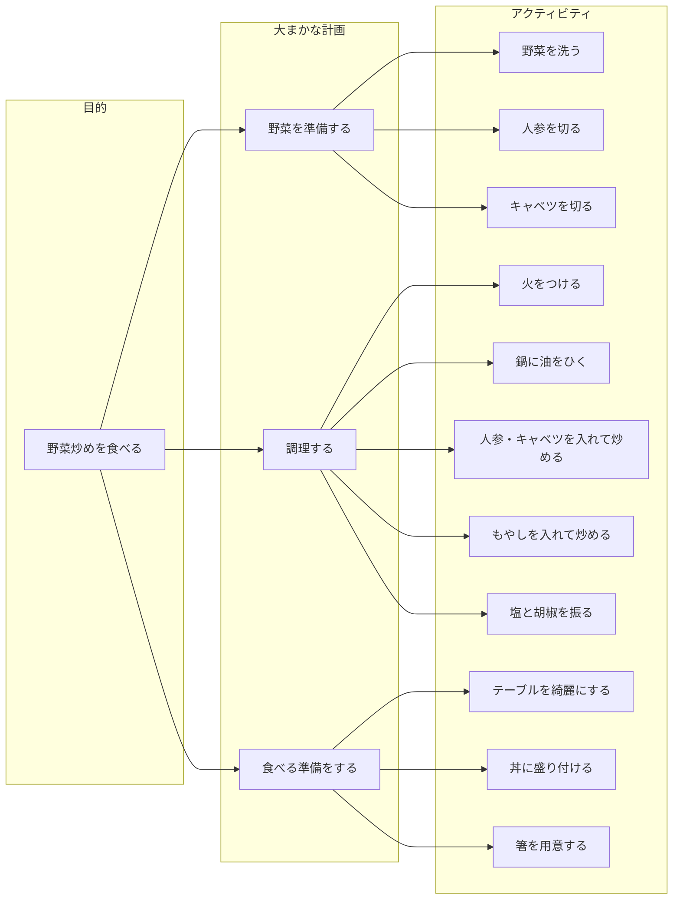

```mermaid
flowchart LR
    subgraph 目的
    first["野菜炒めを食べる"]
    end
    subgraph 大まかな計画
    first-->second1["野菜を準備する"]
    first-->second2["調理する"]
    first-->second3["食べる準備をする"]
    end

    subgraph アクティビティ
    second1-->third1["野菜を洗う"]
    second1-->third2["人参を切る"]
    second1-->third3["キャベツを切る"]

    second2-->third4["火をつける"]
    second2-->third5["鍋に油をひく"]
    second2-->third6["人参・キャベツを入れて炒める"]
    second2-->third7["もやしを入れて炒める"]
    second2-->third8["塩と胡椒を振る"]

    second3-->third9["テーブルを綺麗にする"]
    second3-->third10["丼に盛り付ける"]
    second3-->third11["箸を用意する"]
    
    end
```