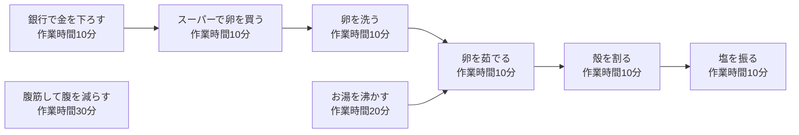

```mermaid
flowchart LR
    third1["銀行で金を下ろす
    作業時間10分"]
    third2["スーパーで卵を買う
    作業時間10分"]
    third3["卵を洗う
    作業時間10分"]
    third4["お湯を沸かす
    作業時間20分"]
    third5["卵を茹でる
    作業時間10分"]
    third6["殻を割る
    作業時間10分"]
    third7["塩を振る
    作業時間10分"]
    third8["腹筋して腹を減らす
    作業時間30分"]
    third1-->third2
    third2-->third3
    third3-->third5
    third4-->third5
    third5-->third6
    third6-->third7
    third8
```